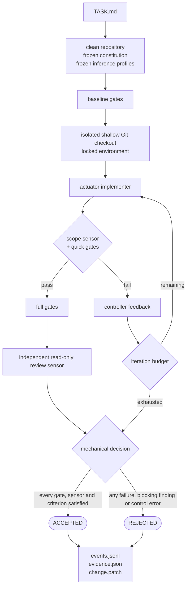

# CodeServo

**AI changes the code. The controller decides whether to accept it.**

CodeServo is a deliberately small experiment in **Software Engineering as a Control System**.
It is not another coding agent. It wraps a coding agent in a deterministic control loop whose source of truth is the target repository.

It grew out of [Vibe coding: how to stay in control of AI-generated
code](https://scalastic.io/en/vibe-coding-ai-software-quality/), which argues
that once agents generate code faster than anyone reads it, quality stops being
a property of the code and becomes a property of the controls around it.
CodeServo is the attempt to build those controls and see what they actually
establish.

## The loop in v0.6.0



The implementer never gets to mark itself done. `ACCEPTED` is computed by CodeServo from explicit evidence.

`FINDINGS.md` records what the experiments run through this controller
established, what they did not, and what follows for its design.

## Deliberate limits

- One actuator and one candidate per run: Claude Code or Codex CLI.
- One target repository per run.
- One bounded implementation loop.
- No auto-commit, auto-merge, PR creation, queue, daemon, UI, memory, multi-agent planning, or learning.
- Full gates run once after quick convergence. A full-gate failure rejects the candidate.
- Review is semantic evidence, not an opaque verdict: the reviewer returns criterion statuses and findings; CodeServo computes the decision.

## Requirements

- Python 3.12+
- Git
- Claude Code or Codex CLI installed and authenticated
- A clean target Git repository
- macOS `sandbox-exec`: the controller confines every actuator and gate process
- Pixi, only when a constitution declares an `[execution]` provider

## Install for development

The reference validation is the locked environment:

```bash
pixi run --locked --no-config test
```

`pixi.lock` is a control input: it is committed and never updated implicitly
while measuring. The suite also runs on the host interpreter, naming the tree it
measures so an ambient install cannot answer for the checkout:

```bash
PYTHONPATH="$PWD/src" python3.12 -m unittest discover -s tests -v
```

An editable install is for development. Drive a run from an artifact installed
outside the target repository, so the running controller never imports code from
the tree it is changing.

## Prepare a target repository

```bash
cd /path/to/project
codeservo init
```

Then edit `.codeservo/constitution.toml`. It is the repository's stable executable constitution.

```toml
version = 1

[scope]
protected = [".codeservo/**", ".github/workflows/**"]
max_changed_files = 20
max_diff_lines = 800

[[gate]]
name = "lint"
phase = "quick"
command = "make lint"
timeout_seconds = 120
baseline = true

[[gate]]
name = "unit"
phase = "quick"
command = "make test-unit"
timeout_seconds = 300
baseline = true

[[gate]]
name = "full"
phase = "full"
command = "make check"
timeout_seconds = 900
baseline = true

[[gate]]
name = "acceptance"
phase = "quick"
command = "pytest -q \"$CODESERVO_SENSOR_PATH\""
timeout_seconds = 300
baseline = false
sensor = "my-project/health-contract"

[review]
blocking_severities = ["blocker", "major"]
```

Commit the constitution. CodeServo refuses to start from a dirty source repository, freezes the constitution at run start, and treats changes under protected paths as control errors.

### Measuring through a locked environment

A constitution may declare an execution provider. A gate then names a task
instead of a shell command, and the controller builds the command line, always
naming the manifest of the tree that gate measures.

```toml
[execution]
provider = "pixi"
manifest = "pyproject.toml"
environment = "default"

[[gate]]
name = "unit"
phase = "quick"
task = "test"
timeout_seconds = 300
baseline = true
```

The lockfile is `pixi.lock` beside the manifest and is not configurable. Before
the baseline the controller freezes the manifest and lockfile digests and the
inventory the lockfile resolves to; a lockfile that disagrees with its manifest
ends the run before any checkout exists. After the isolated checkout is created
and before the first actuation, the environment is installed into the candidate
from the committed lockfile without resolving — never into the source
repository, whose environment must already be there for a baseline task gate.
Every gate process runs under `PIXI_OFFLINE`, `PIXI_NO_INSTALL` and
`PIXI_FROZEN`, so a measurement can neither resolve nor install.

A constitution that declares no provider keeps shell gates unchanged.

## Write one task

```markdown
# Task

## Goal
Add a health endpoint.

## Acceptance criteria
- [AC1] `GET /health` returns HTTP 200.
- [AC2] The response body is `{"status":"ok"}`.
- [AC3] Existing API tests remain green.

## Out of scope
- Authentication changes.
- Dependency upgrades.
```

Acceptance criterion ids are mandatory because the reviewer must account for every criterion and the controller, not the reviewer, computes acceptance.

## Commands

```bash
codeservo init [repo]                     # add a starter constitution
codeservo run --task ./TASK.md            # run one controlled change
codeservo models                          # report the models a backend advertises locally
codeservo verify-run <run-directory>      # verify one run directory
```

### run

```bash
codeservo run --repo /path/to/project --task ./TASK.md
```

```bash
codeservo run \
  --repo /path/to/project \
  --task ./TASK.md \
  --state-dir /path/to/codeservo-state \
  --max-iterations 4 \
  --agent-timeout-seconds 1800 \
  --actuator claude --model <model> --effort <level> --speed standard|fast \
  --review-actuator codex --review-model <model> --review-effort <level> --review-speed standard|fast
```

An inference profile is a complete backend, model, effort and speed. The two
roles are independent control inputs, so a Codex implementation can be decided
by a Claude review or the reverse; `--review-actuator` defaults to the resolved
`--actuator`. Both profiles are checked against the locally projected inventory
of their own backend before the isolated checkout is created. Only an inventory
that lists the model can contradict the request, and only about an effort or a
speed it declares itself; a profile it cannot check is recorded `unverified` and
proceeds, because an inventory is informative and never an authority on what an
account may use. The record keeps the requested profile beside the observed one
and never fills the second from the first.

### models

```bash
codeservo models [--actuator claude|codex] [--model <model>] [--json] [--state-dir <dir>]
```

Reads the provider caches on this machine and nothing else: no agent starts, no
cache is refreshed, and an unreadable cache is reported rather than fatal. The
inventory is a dated, read-only source, not proof that a model is authorized.

### verify-run

```bash
codeservo verify-run <run-directory> [--json]
```

Decides about a run directory from that directory alone.

```text
VALID       every required artefact is present and matches
INVALID     a digest or a relation is false
INCOMPLETE  the record predates a proof this contract requires, or the run never finished
```

Exit status is 0, 1 and 2 in that order, and 3 when the argument holds no
readable `evidence.json`. The command only reads: it writes nothing and never
rewrites the status a run recorded.

It checks the frozen task and constitution, the frozen sensors, the environment
inventory, every artefact the record names by a path and a digest, the digests a
record recomputes from itself, the journal's chain, and the agreement between
the last two events and the recorded decision. A record edited after the fact
cannot make a rejected run look accepted, because the decision is itself an
event the chain closes over.

## Actuators

`--actuator` selects the agent CLI that proposes the change, and reviews it
unless `--review-actuator` names another one. It accepts `claude` and `codex`,
defaults to `$CODESERVO_ACTUATOR`, and falls back to `claude`.

Both backends run without session persistence and without MCP servers, so a run
depends on the frozen task, the frozen constitution, the controller feedback,
and the repository content. Claude Code additionally runs with user memory,
settings, hooks, skills and custom commands disabled; plugin and subagent
definitions installed on the machine stay registered, but the actuator tool set
excludes the tools that would reach them.

| | implementer | reviewer |
| --- | --- | --- |
| `claude` | `--print --safe-mode --strict-mcp-config --disable-slash-commands --no-session-persistence`, tools `Bash,Read,Write,Edit,NotebookEdit` | same, tools `Bash,Read`, structured output validated against the review schema |
| `codex` | `exec --ephemeral --ignore-user-config` | same, plus the frozen output schema |

An effort reaches Claude Code as `--effort` and Codex as
`-c model_reasoning_effort=<level>`; the fast speed tier reaches Claude Code as a
controller-written settings document and Codex as `-c service_tier=priority`.
The record keeps the keys the command actually carried.

Because macOS refuses to apply a seatbelt profile inside another one, a confined
Codex process runs with `--sandbox danger-full-access` and the controller
profile becomes its only confinement. Claude Code runs with its permission
checks bypassed for the same reason, so the controller profile is always its
only confinement.

## State directory

`--state-dir` selects where controller-owned sensors, evidence, and temporary
working trees are stored. It defaults to `~/.codeservo` and must be outside the
target repository. Sensor references in the constitution resolve below
`<state-dir>/sensors/`.

```text
<state-dir>/
├── sensors/<repo>/<sensor>/
├── worktrees/<repo>/<run-id>/
└── runs/<repo>/<run-id>/
    ├── TASK.md
    ├── constitution.toml
    ├── sensors/                 # frozen sensor snapshot
    ├── environment/             # packages.json, when a provider is declared
    ├── baseline/
    ├── iterations/
    │   ├── 01/
    │   │   ├── input.patch
    │   │   ├── prompt.md
    │   │   ├── agent/
    │   │   ├── actuator.patch
    │   │   ├── quick/
    │   │   ├── observed.patch
    │   │   └── controller-feedback.md  # only when sensors fail
    │   └── ...
    ├── full/
    ├── full.patch
    ├── review/
    ├── change.patch
    ├── events.jsonl
    └── evidence.json
```

The evidence directory is outside the target worktree so the actuator cannot
rewrite the controller's record.

## Evidence

`evidence.json` is the summary, checkpointed during the run and declaring its
own shape through `schema_version`. Each iteration records the exact feedback
received, the prompt digest, the repository state before and after actuation,
the state observed after the quick gates, and any feedback generated for the
next iteration. Paths are relative to the run directory, so a copied run remains
self-contained and verifies wherever it is moved. SHA-256 digests cover frozen
sensors, patch snapshots, prompts, feedback, gate outcomes and logs, agent
events and messages, and reviewer artefacts.

The record names the controller that produced it — CodeServo version and source
commit, both actuator names and versions, Python and Git versions — and, for
each role, the requested inference profile beside what the backend reported. A
Claude Code session records the model identifier it resolved to and the tokens
every model spent, because a model alias moves over time while two runs have to
stay comparable.

`events.jsonl` is the trajectory. One immutable event per transition, carrying a
sequence, a payload, the previous event's digest and its own; the digest covers
the canonical form of the event without that field, so the order is verifiable
and an edit anywhere breaks the chain from that point on. Each event reaches the
file system before the transition it records becomes visible, so a decision
never exists only in memory.

```text
run.started  inputs.frozen  inference.profiles_frozen
environment.validated  environment.prepared
gate.finished  baseline.finished  workspace.ready
actuator.started  actuator.finished  actuator.profile_observed
feedback.emitted  budget.exhausted
review.finished  review.profile_observed
decision.recorded  run.finished
```

Events appear where the run took the transition: a constitution declaring no
provider produces no environment event, and nothing claims one happened.

## Isolation

Gates marked `baseline=false` must reference an external acceptance sensor.
CodeServo freezes the sensor and its digest before baseline verification, then
provides its path only to the gate process through `CODESERVO_SENSOR_PATH`.

Every gate runs under a controller-owned profile that makes the run directory
read-only, so a gate reads the frozen sensor it was given but cannot write
anywhere in the record it produces; its own log files are opened by the
controller before the gate starts. Each gate is confined to the tree it
measures — the source repository during the baseline, the isolated checkout
afterwards — whose Git metadata and provider directory are readable and not
writable. Reading survives that confinement: `git status`, `diff`, `log`,
`ls-files` and `rev-parse` all work, and a task gate runs on the environment it
cannot write.

What a profile cannot express is caught afterwards. The controller recomputes
every frozen sensor digest and compares the candidate's state across each
measurement phase, so a gate that changed the tree it was measuring ends the run
even when every gate exited zero — as a control failure naming the phase, not as
a failing gate.

The implementer receives a shallow checkout with no remote, so target repository
history is absent. It runs inside a controller-owned macOS sandbox profile that
denies reads and writes to source sensors, frozen sensors, run evidence, state
repository metadata, and the source repository's Git object store, denies every
write to the source repository, and leaves the candidate's Git metadata and
provider directory readable but not writable. The reviewer runs under the same
profile extended with a write denial covering the whole candidate worktree, so
its read-only nature is mechanical rather than instructed. The actuator receives
only the controller-selected gate output on the next iteration. CodeServo fails
closed where `sandbox-exec` is unavailable.

## Mechanical acceptance rule

A candidate is `ACCEPTED` only when all of the following hold:

1. Both inference profiles were accepted before any checkout existed.
2. The original repository baseline was green.
3. The source repository was and remained clean during baseline.
4. Scope invariants pass.
5. Every quick gate passes within the iteration budget.
6. Every full gate passes.
7. No frozen sensor changed, and no measurement phase changed the candidate.
8. The independent review returns exactly every acceptance criterion as `satisfied`.
9. The review contains no finding whose severity is configured as blocking.

Anything else is `REJECTED`.

## Why this shape

The target repository owns the desired operating envelope
(`.codeservo/constitution.toml`). `TASK.md` supplies a temporary desired delta.
The coding agent is only an actuator. Tests, linters, scope constraints and
independent semantic review are sensors. CodeServo is the controller. Git is the
state substrate. `events.jsonl` and `evidence.json` are the audit record, and
`verify-run` is what makes that record answerable rather than merely stored.

## Self-hosting

Since 0.1.0, CodeServo develops CodeServo. Every behavioural change in the
releases that followed it was proposed by a run of the previous frozen version,
against a pre-registered task and an external acceptance sensor written before
the actuation it constrains, and was accepted only by that version's gates and
its independent reviewer. A frozen version is installed outside this repository and never
imports code from the candidate it is measuring, so a generation never controls
its own construction.

Two things stay maintainer work by construction. Control inputs — the
constitution, the external sensors, the task — cannot come from the actuator
that is measured against them; `.codeservo/**` is a protected path for exactly
that reason. And two early changes that made the test suite compose with gate
and review isolation were made by hand, because the loop could not build the
bridge it needed in order to measure itself.

## Release notes

### 0.6.0

A run records its own trajectory. `events.jsonl` sits beside the record: one
event per transition, chained by digests and flushed before the transition it
records becomes visible. `codeservo verify-run` decides about a run directory
from that directory alone, reporting `VALID`, `INVALID` or `INCOMPLETE`. A
record edited after the fact can no longer make a rejected run look accepted.
Records declare `schema_version` 14 and name their journal.

### 0.5.0

A repository can be measured through an environment its lockfile pins. A
constitution declares an `[execution]` provider, a gate names a task, and the
controller freezes the manifest and lockfile digests and the resolved inventory
before the baseline, then installs the environment into the isolated checkout
without resolving. Every gate is confined to the tree it measures, whose Git
metadata and provider directory become readable and not writable for gates and
actuator alike, and the candidate's state is compared across each measurement
phase, so a gate that changed the tree ends the run even when it exited zero.
Records declare `schema_version` 13 and carry one isolation document per
measured tree.

### 0.4.0

Inference becomes an explicit control input. `codeservo models` projects the
provider caches on this machine into an inventory; a run freezes a complete
backend, model, effort and speed profile and refuses a request that inventory
contradicts, before any checkout or agent process exists. The reviewer carries
its own backend and profile, so the two roles vary independently. The
development environment is locked with Pixi. Records declare `schema_version`
10.

### 0.3.0

The record declares what it is and who produced it: `schema_version` 8, the
CodeServo version and source commit, the actuator name and version, and the
Python and Git versions.

### 0.2.0

The reviewer receives the deterministic gate observations it cannot produce
itself — what each gate measured, carrying no filesystem path and no sensor
source. The controller's own test suite composes with gate and review isolation,
so the confinement is exercised rather than described.

### 0.1.0

The first frozen controller: baseline gates, an isolated shallow checkout, the
actuator, the scope sensor and quick gates, deterministic feedback, full gates,
an independent read-only semantic review, a mechanical decision, portable run
evidence, external acceptance sensors, and a configurable state directory.
