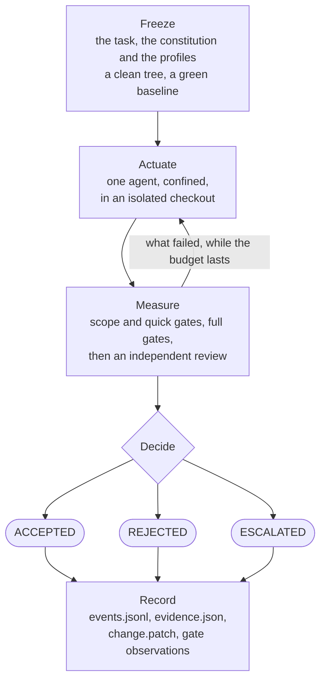

# CodeServo

**AI changes the code. The controller decides whether to accept it.**

CodeServo is a coding agent harness with one difference: **the harness
decides**. The agent is an actuator that proposes a change. A deterministic
controller freezes the rules, isolates the work, measures the result, feeds
back what failed and computes the verdict. `ACCEPTED` is never something a
model says about itself.

A harness of this kind has two halves. Feedforward controls shape what the
agent attempts; feedback controls observe what it did and give it something
specific to correct. The decision belongs to neither, and that is the part most
harnesses leave to the model. CodeServo is one built end to end and small
enough to read. Every claim below is measured rather than asserted, and the
ones still to come say so. [FINDINGS.md](FINDINGS.md) records what the
experiments established, what they did not, and what follows for the design.

It grew out of [Vibe coding: how to stay in control of AI-generated
code](https://scalastic.io/en/vibe-coding-ai-software-quality/), which argues
that once agents generate code faster than anyone reads it, quality stops being
a property of the code and becomes a property of the controls around it.

## The loop



One iteration is one actuation followed by three measurements in order of cost.
The first of them to decide against the candidate writes the feedback the next
iteration starts from. `ACCEPTED` is computed from explicit evidence, and so
are the two other outcomes: `REJECTED` when a deterministic control refused the
candidate or could not measure it, `ESCALATED` when every deterministic control
let it through and what remains is a person's to decide.

[The loop, phase by phase](docs/features/the-loop.md) carries the full diagram
and what each of the five boxes stands for.

## What it controls

| Control | What CodeServo does |
| --- | --- |
| [Sandboxed execution for coding agents](docs/features/sandboxed-execution.md) | Every actuator, reviewer and gate process runs under a controller-owned profile the process cannot negotiate. The profile is one thing; the mechanism applying it is the host's — `sandbox-exec` on macOS, Bubblewrap on Linux — and a host with neither refuses the run rather than executing it unconfined. |
| [Feedback sensors for coding agents](docs/features/feedback-sensors.md) | Compilers, linters, type checkers, test suites, coverage and mutation, wired into the loop so a failure triggers the next iteration before any commit. Each gate answers twice: an exit code, which stays the verdict, and a document saying what it measured. A tool that already writes JUnit XML, SARIF or LCOV needs no adapter at all. |
| [Ratchets on what a gate measured](docs/features/ratchets.md) | A gate that passed can still decide against the candidate. The controller holds the document that gate wrote about the source tree and the one it wrote about the candidate, so a declared metric can be held to a direction across the change without any adapter reconstructing the state before it. |
| [Structured output from LLMs](docs/features/structured-output.md) | The reviewer answers a published JSON schema with a status per acceptance criterion and typed findings. It renders no verdict. The decision is computed from those fields by the controller, in one module, against a rule written down in nine lines. |
| [Context engineering](docs/features/context-engineering.md) | The actuator's context is constructed, never accumulated: a frozen task, a frozen constitution, a shallow checkout with no history, no memory, no session, no MCP. Feedback names each criterion by its id and the control that decides it, carries the findings and metrics of the document a gate wrote, and recaps the iterations already spent. |
| [Findings that become controls](docs/features/evidence.md#the-findings-register) | Every review finding on a candidate that was landed goes to a register, one line each, with a column naming the gate that later covers it. A defect the review caught and no gate did is a control that is missing, recorded as such. |
| [What a run is measured by](docs/features/evidence.md) | The record carries first-pass acceptance, iterations per task, review rounds, what each session consumed and what the controller rated it at, per run and per role. Not lines of code: [throughput is not a measure of productivity](docs/features/evidence.md#what-is-not-measured), and this record carries none. |
| [UX workflows around the loop](docs/features/ux-workflows.md) **· coming** | Everything a person does before the loop and after it: what this repository and this host can actually hold, a task and a sensor that will not fail for one of the nine shapes a control input has failed in, the three outcomes presented as facts naming their artefacts, and a finding that recurs becoming the gate it is owed. Assistants may write those inputs; a person commits them, and the freeze cannot tell the difference. |
| [A published record contract](docs/features/ux-workflows.md#the-contract-those-surfaces-read) **· coming** | `evidence.json` declares its shape through `schema_version` and publishes no schema, so a second reader has to read this code. The moment anything but the controller consumes a record, that contract is the interface. |

Two more properties carry no industry name and are the reason the rest can be
believed.
**The oracle is independent by construction**: an external acceptance sensor is
frozen and digested before the actuation, its source is never readable by the
actuator, and it is re-digested after every measurement. And **a run is
verifiable from its directory alone**: a chained journal, a record that
distinguishes an absence from a measured null, and a `verify-run` command that
reaches one of three verdicts about a directory it only reads.

## What the loop refuses

These are what keep one decision answerable, so they hold inside the loop and
say nothing about what surrounds it — some of which is
[coming](docs/features/ux-workflows.md).

- **One actuator, one candidate, one budget.** No swarm and no team of agents
  negotiating inside the loop: parallel actuation needs an orchestrator, a work
  ledger and a merge mechanism, and no gate could measure any of the three.
  Three sequential review roles with disjoint contexts are three sensors and
  stay in scope.
- **No MCP, no memory, no session.** A run depends on the frozen inputs and the
  repository content, and on nothing else the machine happens to carry.
- **Nothing between the model and the verdict.** The decision is computed from
  the record. A surface that summarised it would become what people read
  instead, so none stands there; a surface that reads the record afterwards is
  a different thing and does not decide.
- **No agent instruction bloat.** A recurring defect becomes a gate or a
  sensor, never one more paragraph of instructions.
- **No durability left to chance.** Every transition reaches the file system
  before it becomes visible, and the journal chains each event to the previous
  one, so a decision never exists only in memory and an edit anywhere breaks
  the chain from that point on.
- **No auto-commit, auto-merge, PR or queue.** An accepted run is landed by a
  person running one command.

## Getting started

```bash
pip install git+https://github.com/jeanjerome/codeservo   # nothing is published yet
codeservo doctor                 # what this host provides, and what is missing
cd /path/to/project
codeservo init                   # writes a starter .codeservo/constitution.toml
$EDITOR .codeservo/constitution.toml
codeservo run --task ./TASK.md --model <model> --effort medium
```

The exit status is the decision: 0 for `ACCEPTED`, 1 for `REJECTED`, 2 for
`ESCALATED`. You need Python 3.12+, Git, Claude Code or Codex CLI installed and
authenticated, a clean target repository, and a host carrying a confinement
mechanism — macOS, or Linux with Bubblewrap installed and unprivileged user
namespaces allowed.

[Prepare a target repository](docs/features/target-repository.md) says what a
constitution declares and how a task is written. [Commands](docs/features/commands.md)
is the command line in full. [Running one controlled change](docs/RUNNING-A-CHANGE.md)
is the order of operations around a single run.

## Where the rest lives

| | |
| --- | --- |
| What the controller is made of, layer by layer | [docs/ARCHITECTURE.md](docs/ARCHITECTURE.md) |
| Rules a change to the controller must respect | [docs/QUALITY.md](docs/QUALITY.md) |
| How the controller measures itself | [docs/COMMANDS.md](docs/COMMANDS.md) |
| Every feature above, in detail | [docs/features/](docs/features/) |
| What the experiments established | [FINDINGS.md](FINDINGS.md) |
| What each version brought | [docs/RELEASE-NOTES.md](docs/RELEASE-NOTES.md) |

CodeServo developed CodeServo from 0.1.0 to 0.6.0, one frozen generation
proposing the next through this loop. It no longer does, and
[why](docs/features/self-hosting.md) is a result rather than a retreat.
