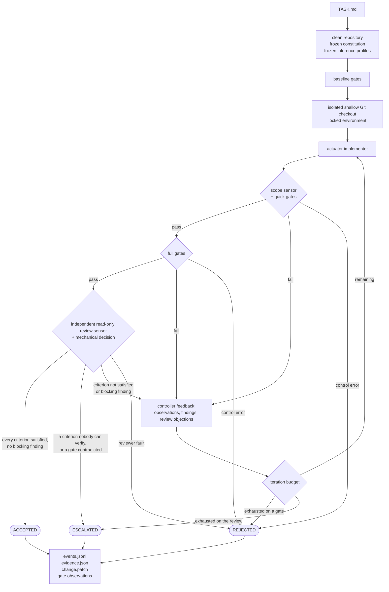

# The Loop, Phase by Phase

The [front page](../../README.md#the-loop) shows five boxes. This is what each
one stands for, and the whole of it in one diagram.

## Freeze — a starting state nothing can argue with afterwards

One rule governs the order: **a control input is versioned before the actuation
it constrains.** A contract written after the change it judges cannot be told
apart from a contract written to fit it, and nothing in the record recovers the
difference later.

So a run refuses to start on a dirty tree — whatever is uncommitted is not what
was measured, and the record would name a base commit that does not describe
the tree. It then freezes and digests the task, the constitution, the model
catalogue and every external sensor into the run directory, and names the
inference profile of each role before any checkout exists. A model the
catalogue does not list is refused by name at that point, and a criterion
naming a gate no constitution declares ends the run there.

The baseline is measured last, on the source tree: every gate the constitution
marks `baseline = true` runs on the repository as it is. A red baseline ends the
run instead of charging the candidate for it, and the documents those gates
wrote are what a [ratchet](ratchets.md) later compares against.

See [preparing a target repository](target-repository.md) and, for the order in
full, [RUNNING-A-CHANGE.md](../RUNNING-A-CHANGE.md).

## Actuate — one agent, holding only what it was given

The candidate is a shallow Git checkout with no remote, so the target
repository's history is absent. The declared environment is installed into it,
and the agent runs inside a controller-owned profile it cannot negotiate: the
source repository is read-only, the sensors and the run's own evidence are
unreachable, and the candidate's Git metadata and provider directory stay
readable but not writable.

What reaches the model is the frozen task, the constitution as the candidate is
allowed to see it, the checkout, and the feedback the controller wrote on the
previous iteration. No memory, no session, no MCP.

See [sandboxed execution](sandboxed-execution.md) and
[context engineering](context-engineering.md).

## Measure — three stages, in order of cost

An iteration measures the candidate three times, cheapest first, and stops at
the first stage that decides against it.

1. **The scope sensor and the quick gates.** Scope first: a change touching a
   protected path, or exceeding the declared file or line budget, is refused
   before any gate runs. Then every `phase = "quick"` gate.
2. **The full gates**, once the quick ones passed.
3. **The independent review**, once the full gates passed. It sees one
   iteration's candidate, nothing of the reviews before it, and only the
   criteria the task did not hand to a gate.

Three things can come out of a stage, and they are not the same thing. A
**failure** writes the feedback the next iteration starts from. A **passing
gate can still refuse** the candidate through a [ratchet](ratchets.md) it
declares, read against what the same gate reported at the baseline. And a
**control error** ends the run immediately: a gate that changed the tree it was
only measuring, a sensor that could not say what it saw, a reviewer that
misreported the criteria it was asked to decide. A control error is not a
failing measurement, and nothing is fed back on that path because nothing there
is the candidate's to correct.

What a profile cannot express is caught afterwards: every frozen sensor digest
is recomputed and the candidate's state is compared across each measurement
phase, so a gate that changed the tree ends the run even when every gate exited
zero.

See [feedback sensors](feedback-sensors.md) and [ratchets](ratchets.md).

## Decide — computed, never reported

The budget counts iterations whatever stage ended them. When it is spent, or
when nothing decided against the candidate, the controller computes one of
three outcomes from the evidence alone — the implementer never marks itself
done, and the reviewer renders no verdict.

`ACCEPTED` when every deterministic control passed and the review returned
exactly the criteria left to it, each satisfied, with no blocking finding.
`ESCALATED` when every deterministic control let the candidate through and the
review alone leaves it undecided. `REJECTED` for anything else. The exit status
is 0, 1 and 2 in that order.

See [structured output and the decision](structured-output.md) for the rule in
full.

## Record — the run answers from its own directory

Whatever the outcome, the run leaves a directory that answers on its own: a
chained journal of every transition, a record naming each artefact by a path
and a digest, the patch, and the document each gate wrote about what it
measured. `codeservo verify-run` reaches one of three verdicts about that
directory while writing nothing into it.

See [evidence](evidence.md).
